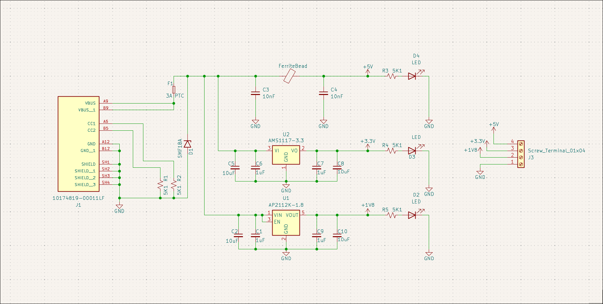

# MiniBench

A compact USB-C powered bench power supply board designed to provide common rail voltages directly from your laptop or a USB-C power adapter.

## Features
- **USB-C Input:** Convenient power sourcing from modern laptops and chargers.
- **Triple Voltage Output:** Provides stable power rails for most low-power electronics development:
  - **5.0V**
  - **3.3V**
  - **1.8V**
- **Compact Form Factor:** Small enough to fit in a pocket or a small electronics kit.

## Usage
Simply plug into a USB-C port to provide power to the onboard regulators, then use the designated headers/pads to power your breadboard or prototype.

## License
Licensed under the MIT License (see LICENSE file for details).
